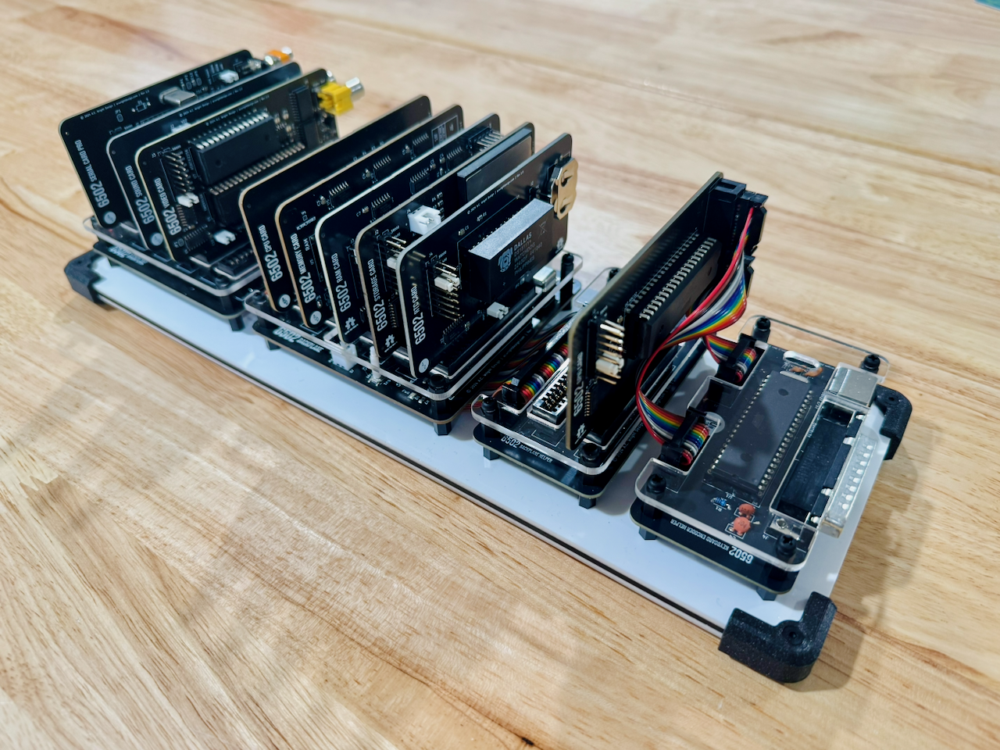

6502-COB
========

An **AC6502** retro-style 8-bit computer based on the **65C02** microprocessor.

---

## Overview

The AC6502 ecosystem is a family of open-source, 65C02-based computers sharing a common architecture, memory map, and [BIOS](https://github.com/acwright/6502-BIOS). Each computer in the family is purpose-built for a different use case but runs the same software and firmware.

The **COB** (Computer on a Backplane) is a full-featured modular desktop computer. It features a real 65C02 CPU, a backplane architecture with expandable card slots, up to 544KB RAM, composite or VGA video output, CompactFlash or SD storage, a real-time clock, and support for PS/2 keyboards, matrix keyboards, and Atari 2600-compatible joysticks. It is the most versatile and expandable system in the AC6502 family.

---

## Architecture

All AC6502 computers share:

- **CPU**: 65C02 (or accurate emulation)
- **Memory**: 32KB RAM + 32KB ROM, with optional banked RAM expansion
- **Memory Map**: Standardized across the ecosystem — zero page, stack, I/O space ($8000–$9FFF), system ROM, and interrupt vectors at $FFFA–$FFFF
- **Bus**: 16-bit address bus, 8-bit bidirectional data bus, standard 65C02 control signals (RW, PHI2, RESET, IRQ, NMI, RDY, SYNC)
- **BIOS**: A common [BIOS](https://github.com/acwright/6502-BIOS) provides the kernel, monitor, and BASIC interpreter across all systems

---

## Hardware

This repository contains KiCad 7.0+ PCB designs for the backplanes, cards, and helpers that make up the COB system.

### Backplanes

**`Hardware/Backplane/`** — Passive backplane providing 5 card slots with full bus interconnect across all slots.

**`Hardware/Backplane Pro/`** — Enhanced backplane with integrated clock generation, reset circuitry, and power distribution plus 5 card slots.

**`Hardware/Backplane Helper/`** — Adds additional card slots to expand the total backplane configuration up to 12 slots.

### Cards

**`Hardware/CPU Card/`** — Hosts the 65C02 CPU in a card form factor for backplane-based COB systems.

**`Hardware/CPU Card Pro/`** — Hosts a 65816 16-bit CPU (backward-compatible with 65C02). *(Untested)*

**`Hardware/Memory Card/`** — Provides 32KB SRAM and 32KB EEPROM with address decoding logic for COB systems using the CPU Card.

**`Hardware/RAM Card/`** — 512KB banked RAM expansion organized as two 256KB banks with 256 × 1KB windows each.

**`Hardware/RTC Card/`** — Real-time clock via Dallas DS1511Y with battery backup and 256 bytes of battery-backed SRAM.

**`Hardware/GPIO Card/`** — General-purpose I/O via 65C22 VIA supporting keyboards, joysticks, timers, and custom devices.

**`Hardware/Serial Card/`** — RS-232 serial communication via 65C51 ACIA and MAX232 level shifter.

**`Hardware/Serial Card Pro/`** — Enhanced serial card with full modem control signals (DTR, DCD, DSR).

**`Hardware/VGA Card/`** — VGA 640×480 video output via Raspberry Pi Pico running [Pico9918](https://github.com/visrealm/pico9918) with TMS9918A-compatible graphics modes.

**`Hardware/VGA Card Pro/`** — Fully programmable VGA output using Pi Pico with custom firmware. *(Untested)*

**`Hardware/Video Card/`** — Composite video output via TMS9918A Video Display Processor with 16KB video RAM.

**`Hardware/Video Card Pro/`** — Enhanced composite video card. *(Untested)*

**`Hardware/Sound Card/`** — 3-voice SID audio output via ARMSID module with RCA line-level output.

**`Hardware/Storage Card/`** — CompactFlash storage interface supporting up to 128GB via IDE-compatible protocol.

**`Hardware/Storage Card Pro/`** — SD card (up to 32GB) and 16MB onboard SPI flash storage interface. *(Untested)*

**`Hardware/LCD Card/`** — 16×2 character LCD display via 65C22 VIA in 4-bit or 8-bit mode.

**`Hardware/Blinkenlights Card/`** — Visual bus monitoring with LEDs showing address bus (16), data bus (8), and control signals (8) in real time.

**`Hardware/Prototype Card/`** — Blank prototyping area with integrated breadboard and full bus access headers.

### Helpers

**`Hardware/Keyboard Encoder Helper/`** — ATmega1284p-based dual keyboard encoder supporting PS/2 keyboard and 8×8 matrix keyboard simultaneously via 65C22 VIA.

**`Hardware/PS2 Helper/`** — ATmega328p-based PS/2 keyboard bridge that drives an MT8808 analog crosspoint switch to emulate a matrix keyboard for the 65C22 VIA.

**`Hardware/Keyboard Helper/`** — 64-key matrix keyboard with Atari 2600-compatible joystick support.

**`Hardware/GPIO Helper/`** — 8 buttons and 8 LEDs for testing and debugging GPIO Card connections.

**`Hardware/GPIO Breadboard Helper/`** — Breadboard interface adapter for the GPIO Card.

**`Hardware/Joystick Helper/`** — Atari 2600-style dual joystick connector and interface board.

**`Hardware/Clock Helper/`** — Manual clock control providing single-step, free-run, and halt modes for debugging real CPU systems.

**`Hardware/DB25 Helper/`** — GPIO to DB25 connector adapter for external device interfacing.

**`Hardware/Breadboard Helper/`** — Exposes the full AC6502 bus to a breadboard for prototyping and experimentation.

**`Hardware/Mega Helper/`** — Arduino Mega 2560 interface adapter for the AC6502 bus.

**`Hardware/LCD Board/`** — 320×240 TFT LCD display (ILI9341) interfaced via 65C22 VIA. *(Untested)*

**`Hardware/VERA Helper/`** — VERA FPGA video module adapter for the AC6502 bus.

---

## Firmware

This repository contains [PlatformIO](https://platformio.org/)-based firmware for the COB system's microcontroller helpers.

### KEH Controller
`Firmware/KEH Controller/`

Firmware for the ATmega1284p on the Keyboard Encoder Helper. Provides:

- Simultaneous PS/2 keyboard and 8×8 matrix keyboard scanning
- ASCII conversion with modifier key support (Shift, Ctrl)
- Buffered, debounced input handling
- Parallel I/O to the AC6502 bus via 65C22 VIA

See [Firmware/KEH Controller/README.md](./Firmware/KEH%20Controller/README.md) for setup and usage instructions.

### PS2 Keyboard Controller
`Firmware/PS2 Keyboard Controller/`

Firmware for the ATmega328p on the PS2 Helper. Provides:

- Interrupt-driven PS/2 keyboard scan code reading
- MT8808 analog crosspoint switch matrix control
- Make/break detection and extended scan code support
- Function key emulation via FN key combinations

See [Firmware/PS2 Keyboard Controller/README.md](./Firmware/PS2%20Keyboard%20Controller/README.md) for setup and usage instructions.

### STP Controller
`Firmware/STP Controller/`

Firmware for the ATmega328p on the Storage Card Pro. Provides:

- Memory-mapped SPI controller for 6502 bus access
- Support for SD card, 16MB SPI flash, and external SPI devices
- Dual-speed SPI (4 MHz normal operation, 400 kHz initialization)
- PHI2-synchronized interface for reliable 6502 communication

See [Firmware/STP Controller/README.md](./Firmware/STP%20Controller/README.md) for setup and usage instructions.

---

## CAD
`CAD/`

3D-printable enclosure parts and laser-cut top panels for the COB system.

---

## Production
`Production/`

JLCPCB-ready Gerber files and BOM/CPL for PCB fabrication and assembly.

---

## Schematics
`Schematics/`

PDF schematics for each board.

---

## Libraries
`Libraries/`

Shared KiCad symbol and footprint libraries used across all AC6502 hardware projects.

---

## AC6502 Projects

| Project | Description |
|---------|-------------|
| [6502-BIOS](https://github.com/acwright/6502-BIOS) | The shared BIOS (kernel, monitor, BASIC) for all AC6502 computers |
| [6502-PRG](https://github.com/acwright/6502-PRG) | Template for writing assembly language programs |
| [6502-CRT](https://github.com/acwright/6502-CRT) | Template for writing assembly language cartridges |
| [6502-EMULATOR](https://github.com/acwright/6502-EMULATOR) | Node.js-based AC6502 emulator |
| [6502-WEBULATOR](https://github.com/acwright/6502-WEBULATOR) | Web-based AC6502 emulator |

---

## AC6502 Systems

| Project | Description |
|---------|-------------|
| [6502-ACE](https://github.com/acwright/6502-ACE) | All-in-one single-PCB computer — the COB experience without the backplane |
| [6502-COB](https://github.com/acwright/6502-COB) | Computer on a Backplane — modular desktop computer with expandable card slots (you are here) |
| [6502-DEV](https://github.com/acwright/6502-DEV) | Development Environment Vehicle — emulation-based dev system |
| [6502-KIM](https://github.com/acwright/6502-KIM) | KIM-1 inspired minimal computer |
| [6502-VCS](https://github.com/acwright/6502-VCS) | Video Computer System — cartridge-based retro gaming console |

---

## License

Hardware designs are released under the [CERN Open Hardware Licence Version 2 – Permissive](https://ohwr.org/cern_ohl_p_v2.txt).  
Firmware is released under the [MIT License](./Firmware/KEH%20Controller/LICENSE).
